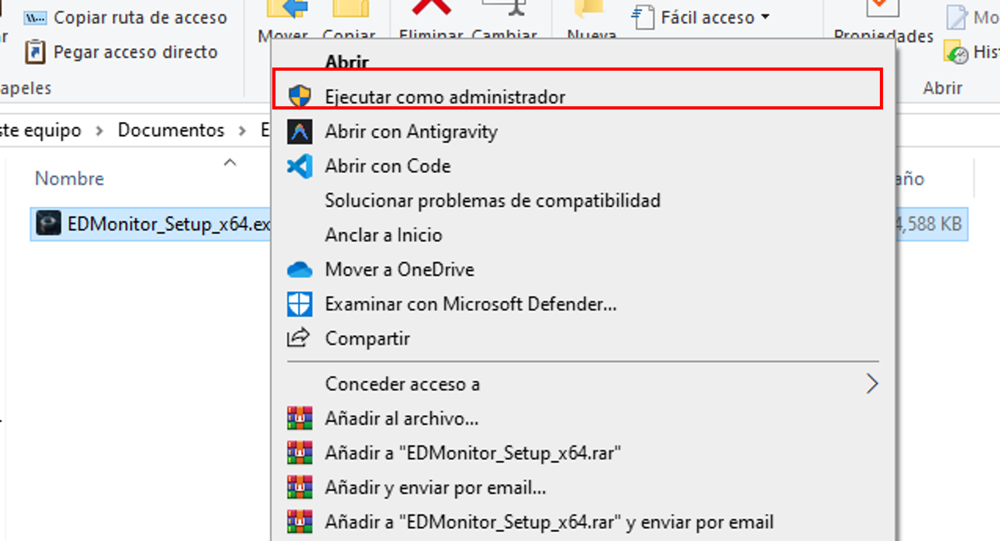
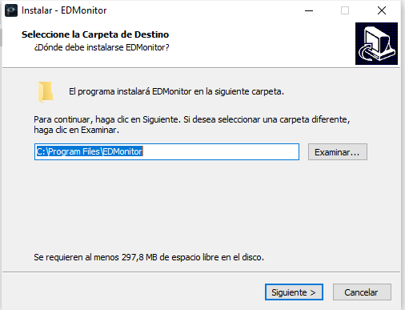
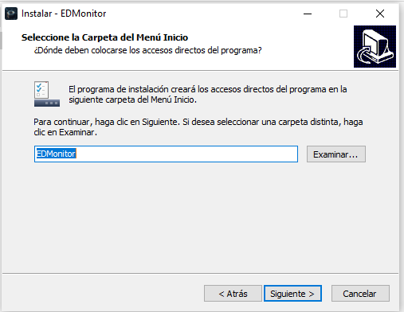
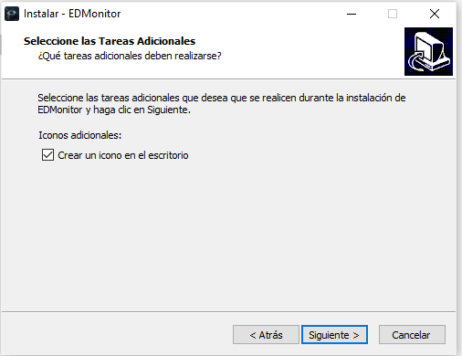
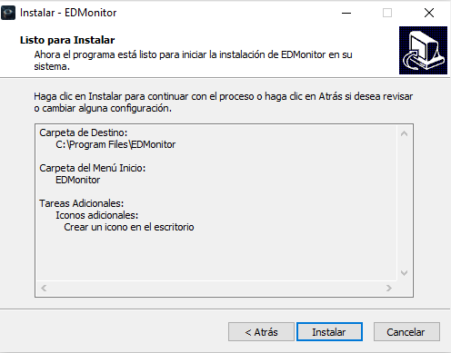
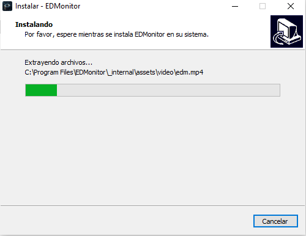
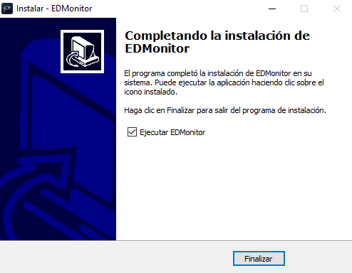

# 🚀 EDMonitor Setup - Guía de Instalación

Bienvenido al instalador de **EDMonitor**, una herramienta avanzada diseñada para realizar cálculos precisos y monitoreo simplificado de procesos.

Esta guía te llevará paso a paso a través del proceso de instalación para asegurar que el software quede configurado correctamente en tu sistema.

---

## � Descarga del Instalador
Debido al peso del paquete de instalación, el archivo se encuentra alojado en OneDrive. Puedes descargarlo en el siguiente enlace:

> [!IMPORTANT]
> **[Descargar EDMonitor Setup (.rar)](https://estunanleonedu-my.sharepoint.com/:f:/g/personal/manuel_ruiz24_est_unanleon_edu_ni/IgBvFtiClT9FRrnznfuBUr7cAclN1yuPCYvTTG5_6MENfYA?e=PJ09g4)**

---

## 📺 Video Demo
Mira el video de demostración para conocer las capacidades de **EDMonitor** en acción:

---

## �🛠️ Requisitos del Sistema
- **Sistema Operativo:** Windows 8 o superior (x64 recomendado).
- **Espacio en Disco:** ~200 MB libres.
- **Acceso:** Permisos de administrador para la instalación.

---

## 📦 Proceso de Instalación (Paso a Paso)

Sigue estas instrucciones visuales para completar la instalación de manera exitosa:

### 1️⃣ Selección del Idioma
Inicia el instalador y selecciona el idioma de tu preferencia para el asistente de instalación.

### 2️⃣ Asistente de Instalación
Se abrirá el asistente de Inno Setup. Haz clic en **Siguiente** para comenzar el proceso.

### 3️⃣ Ubicación de Destino
Elige la carpeta donde deseas que se instale **EDMonitor**. Por defecto se instalará en `Archivos de Programa`.

### 4️⃣ Carpeta del Menú Inicio
Define el nombre de la carpeta que aparecerá en tu menú de inicio para acceder rápidamente a la aplicación.

### 5️⃣ Tareas Adicionales
Selecciona si deseas crear un acceso directo en el escritorio para un acceso más ágil.

### 6️⃣ Listo para Instalar
Revisa el resumen de la configuración. Si todo es correcto, presiona **Instalar**.

### 7️⃣ Finalización
¡Instalación completada! Ahora puedes marcar la casilla para ejecutar EDMonitor inmediatamente y presionar **Finalizar**.

---

## ✨ Características Principales
- **Cálculos Rápidos:** Algoritmos optimizados para procesamiento inmediato.
- **Monitoreo de Gages:** Interfaz intuitiva para seguir tus variables críticas.
- **Diseño Moderno:** Estética premium diseñada para la mejor experiencia de usuario.

---

## 👨‍💻 Créditos
- **Diseño y Programación:** Manuel de Jesús Ruiz Martínez.

---

> [!TIP]
> Si encuentras algún inconveniente durante la instalación, asegúrate de haber extraído completamente el contenido del archivo `.rar` antes de ejecutar el instalador.
